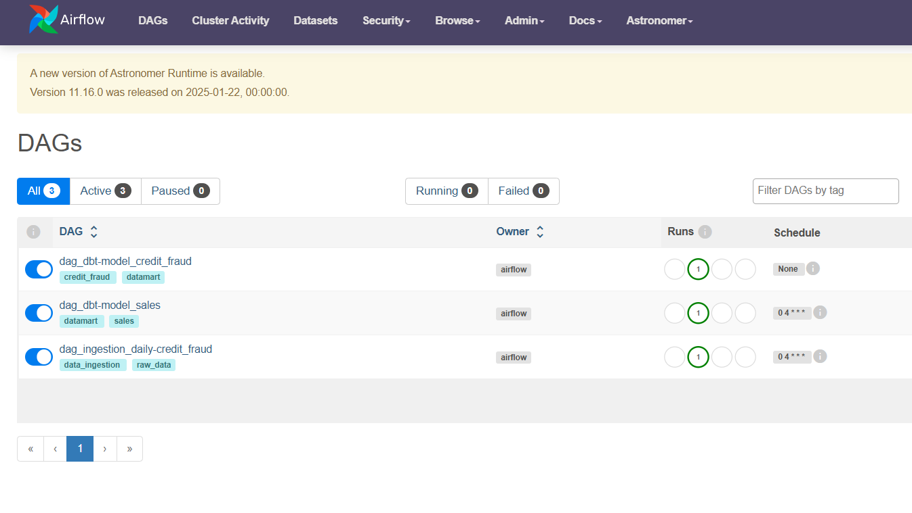
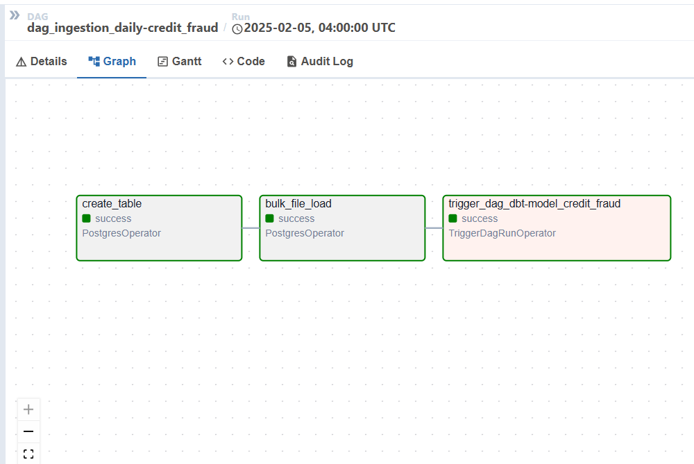
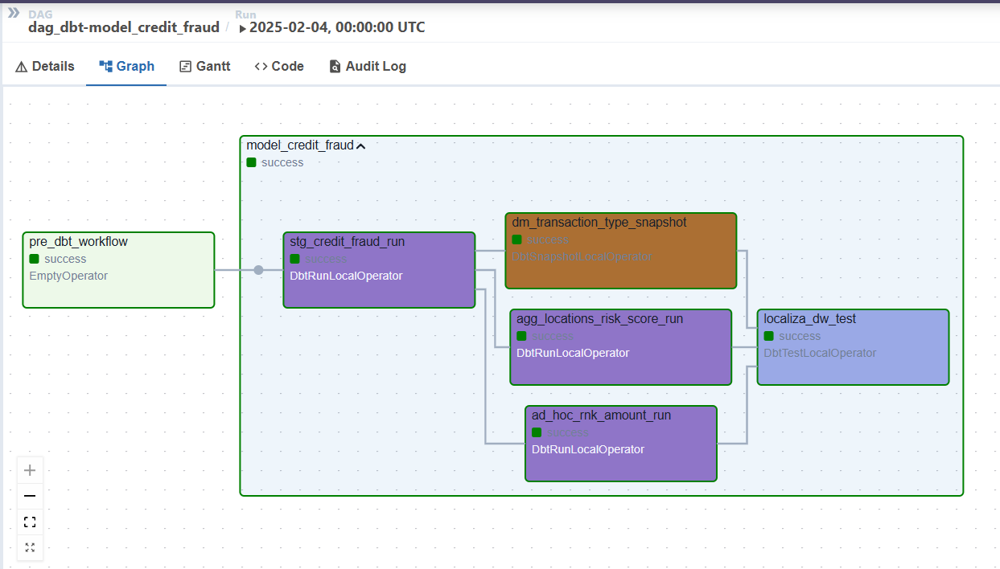
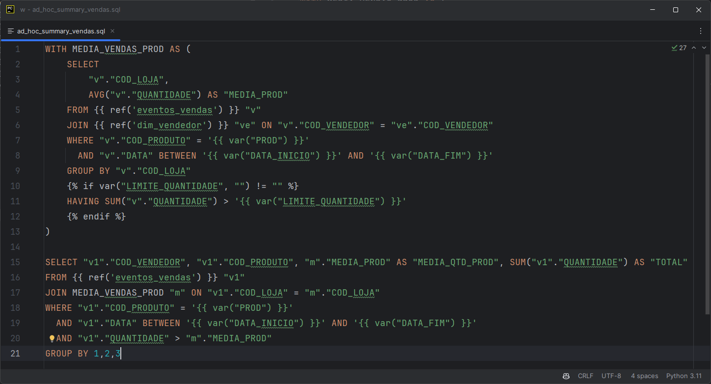
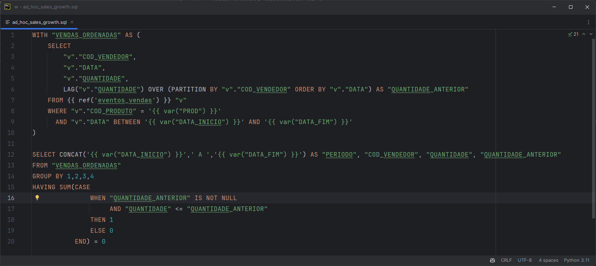
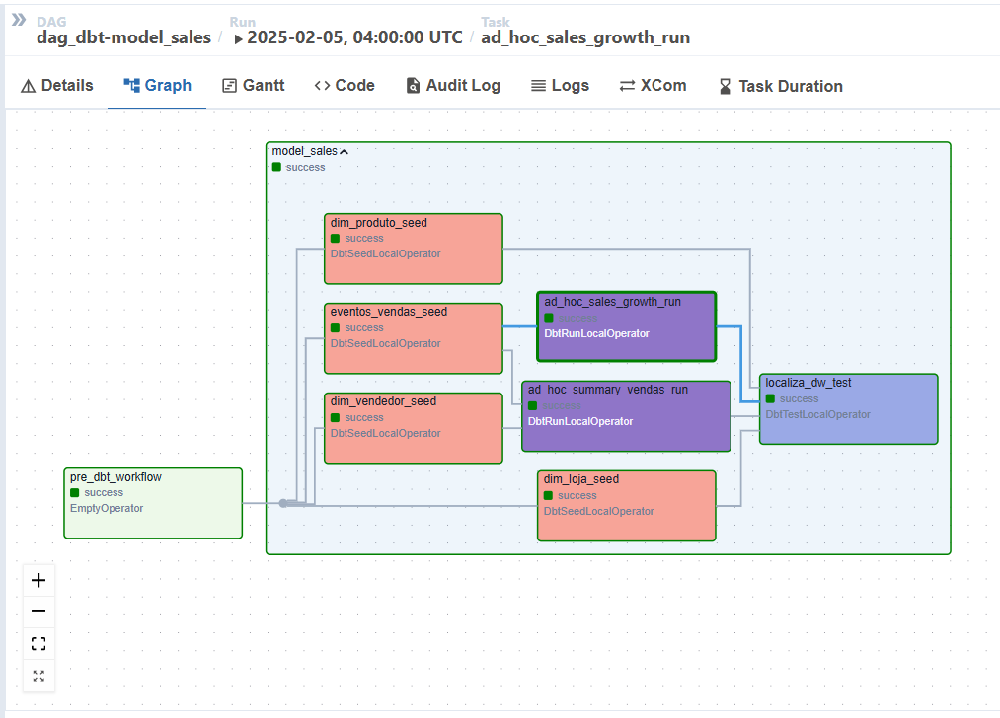

# Localiza Data Engineering Case

## 📖 Introdução

Este projeto foi desenvolvido como parte do test case para a Localiza, com foco na criação de pipelines de dados utilizando ferramentas de orquestração e modelagem de dados.

Temas abordados:
- Ingestão de arquivos CSV para transformação e análise de dados.
- Execução de consultas SQL.
- Implementação de pipelines utilizando Airflow, Docker e DBT.

---

## 🔧 Recursos Utilizados

- **Apache Airflow:** Orquestração de workflows.
- **DBT:** Transformações de dados SQL.
- **Docker:** Containerização para garantir reprodutibilidade.
- **Postgres:** Armazenamento dos dados processados.

---

## 🚀 Passo a Passo de Execução

1. **Clone o repositório:**  
   ```bash
   git clone <url_do_repositorio>
   ```

2. **Entre no diretório do projeto:**  
   ```bash
   cd <nome_do_repositorio>
   ```
4. **Copie o arquivo csv do desafio para pasta:**  
   ```bash
   cp -r <endereco_atual_do_csv> csv/raw_fraud_credit.csv
   ```

3. **Suba os contêineres com Docker Compose:**  
   ```bash
   docker compose up -d
   ```

5. **Acesse o Airflow no navegador:**  
   [http://localhost:8080](http://localhost:8080)

6. **Observe as DAGs listadas e inicie conforme necessário.**  
   

---

## 🔍 Desafios Propostos e Soluções

### Desafio 1: Ranking de regiões por média de "Risk Score" e análise de transações recentes

**Descrição do Desafio:**  
1. Implementar um pipeline que:  
   - Importe dados de um arquivo CSV.  
   - Realize a limpeza e carregamento em tabelas intermediárias.  
   - Gere uma tabela-resultado com a média de "risk score" por região.  
   - Gere uma tabela-resultado listando os 3 maiores "receiving address" por "amount" considerando transações mais recentes.

**Soluções Implementadas:**  
- **Modelos:**  
  - `myCosmosDbt/dags/dbt/localiza_dw/models/staging/credit_fraud`  
  - `myCosmosDbt/dags/dbt/localiza_dw/models/marts/credit_fraud`  

- **DAGs:**  
  - `myCosmosDbt/dags/dag_ingestion_daily-fraud_credit.py`  
  - `myCosmosDbt/dags/dag_dbt-model_fraud_credit.py`
- **DAG:**  
  - `DAG Ingestão`
  
  - `DAG Modelagem`
  

---

### Desafio 2: Consultas SQL para análise de vendedores

**Descrição do Desafio:**  
1. Esboce uma consulta SQL que:
   - Vendem quantidade de itens do produto de código PROD maior que a
média de vendas por vendedor do produto de código PROD em sua loja;

   - Vendem quantidade de itens do produto de código PROD maior que a
média de vendas por vendedor do produto de código PROD nas lojas com
mais de 1000 vendas do produto de código PROD no período; 

**Soluções Implementadas:**

Para solução foi desenvolvido uma query dinamica, utilizando `vars` do DBT para passar os parametros de entrada.

- **Modelos:**  
  - `myCosmosDbt/dags/dbt/localiza_dw/models/marts/sales/ad_hoc_summary_vendas.sql`

- **DAGs:**  
  - `myCosmosDbt/dags/dag_dbt-model_sales.py`
- **Script DBT:**  
  - `SQL`


2. Esboce uma consulta SQL que:  
   - Liste vendedores cujas vendas do produto PROD foram sempre crescentes no período especificado.

**Soluções Implementadas:**  
- **Modelos:**  
  - `myCosmosDbt/dags/dbt/localiza_dw/models/marts/sales/ad_hoc_sales_growth.sql`

- **DAGs:**  
  - `myCosmosDbt/dags/dag_dbt-model_sales.py`

- **Script DBT:**  
  - `SQL`


- **DAG:**  
  - `DAG Sales`


---

## 🛠 Estrutura do Projeto

```
localiza_case/
├── dags/
│   ├── dag_dbt-model_sales.py
│   ├── dag_dbt-model_fraud_credit.py
│   ├── dag_ingestion_daily-credit_fraud.py
│   ├── dbt/
│   │   └── localiza_dw/
│   │       └── models/
│   │          ├── marts/
│   │          └── staging/
│   └── docker-compose.yml
└── README.md
```

---
